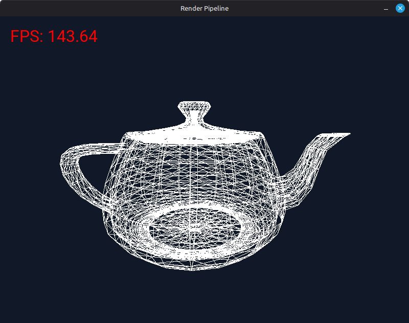

# CSE-483-weeks

Bu repo, CSE 483 kapsamındaki bilgisayar grafikleri ders notlari ve hafta hafta
gelistirilen C/C++ alistirma kodlarini bir arada tutmak icin kullanilir. Amac,
derslerde anlatilan temel grafik konularini yalnizca teorik PDF'lerle degil,
calistirilabilir kucuk ornekler ve basit bir yazilim render pipeline'i uzerinden
deneyerek takip etmektir.



## Icerik

- `docs/`: Ders slaytlari ve konu notlari. Cizgi cizimi, poligonlar,
  2D/3D donusumler, gorunurluk, isiklandirma, ray tracing, stereo goruntu ve
  collision gibi konulari icerir.
- `render-pipeline/`: SDL2 ile pencereye cizim yapan, CPU tarafinda calisan
  basit bir render pipeline denemesi.
- `render-pipeline/lectures/`: Derste islenen algoritmalarin ve pipeline
  adimlarinin C implementasyonlari.
- `render-pipeline/types/`: Vektor, mesh ve transform veri tipleri.
- `render-pipeline/resources/`: Demo sahnede kullanilan font ve Utah teapot OBJ
  dosyalari.

## Render Pipeline

`render-pipeline` alt projesi, 3D bir modeli yazilim tarafinda isleyip ekrana
cizmek icin hazirlanmis egitsel bir ornektir. Su anda demo sahnede Utah teapot
modeli yuklenir, mesh merkezi orijine alinir, kamera/projeksiyon/viewport
matrisleri uygulanir ve sonuc SDL2 penceresinde gosterilir.

Pipeline icinde:

- OBJ mesh yukleme,
- model, kamera ve viewport donusumleri,
- render queue olusturma,
- color ve depth buffer kullanimi,
- SDL2 uzerinden pencereye aktarim,
- FPS yazisi icin SDL2_ttf destegi

gibi temel parcaciklar bulunur. Bu yapi, derslerdeki matematiksel adimlari
kodun icinde takip etmeyi kolaylastirmak icin kucuk ve okunabilir tutulmustur.

## Derleme ve Calistirma

Gerekli paketler:

```bash
sudo apt update
sudo apt install build-essential pkg-config libsdl2-dev libsdl2-ttf-dev
```

macOS icin:

```bash
brew install sdl2 sdl2_ttf pkg-config
```

Render pipeline demosunu calistirmak icin:

```bash
cd render-pipeline
make
make run
```

Temizlemek icin:

```bash
make clean
```

## References
* [https://graphics.cs.utah.edu/teapot/](https://graphics.cs.utah.edu/teapot/)
* [https://fonts.google.com/](https://fonts.google.com/)